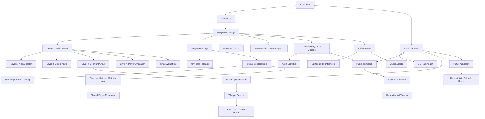
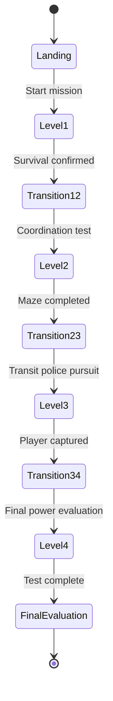
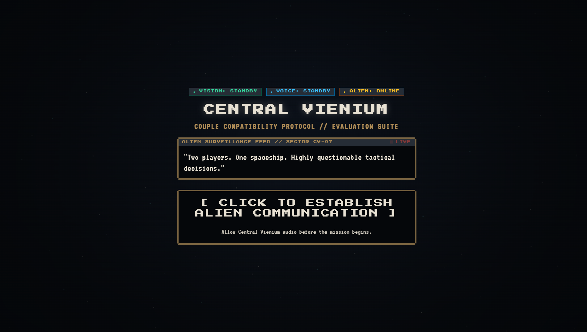
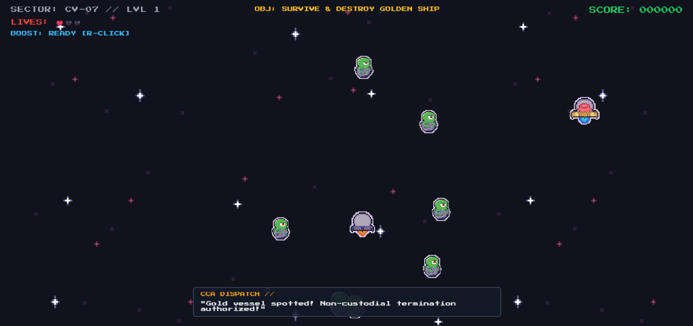
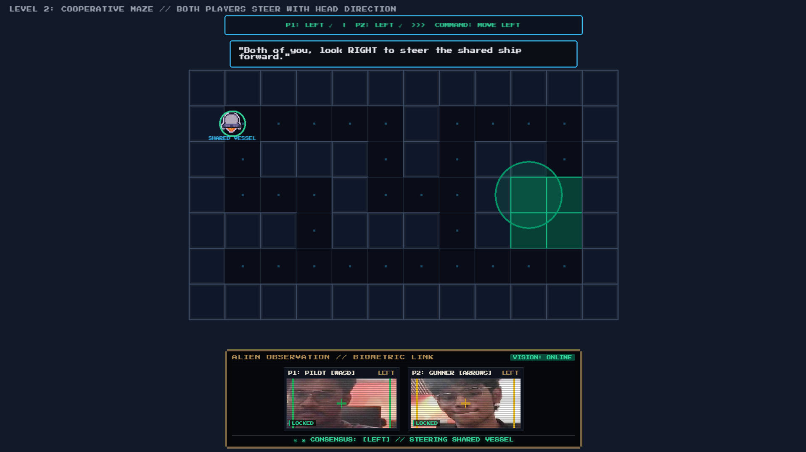
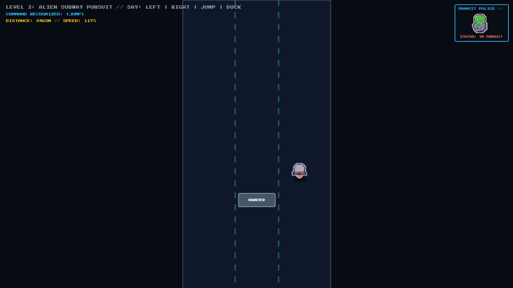
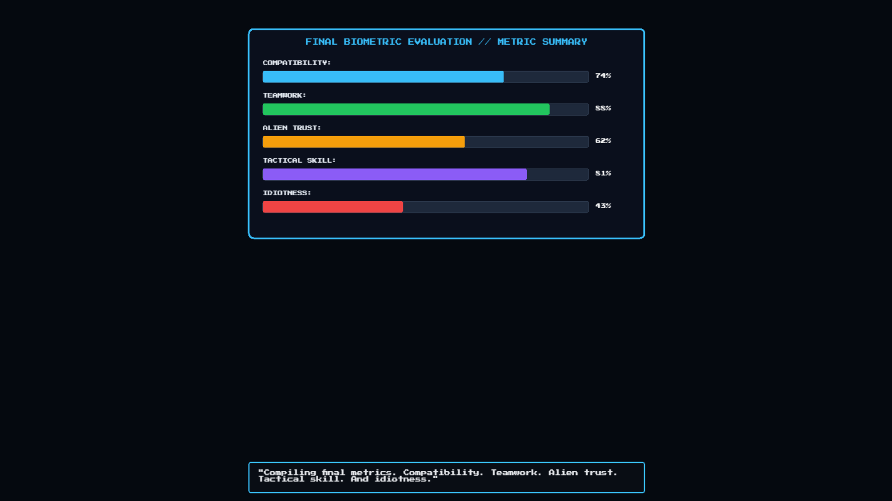
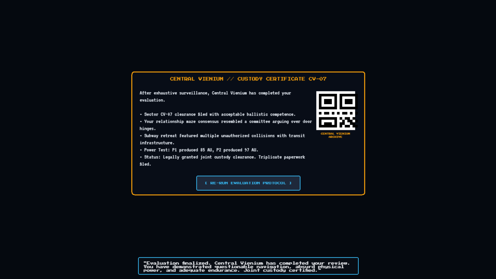

 # CENTRAL VIENIUM 👽🚀

 ## Basic Details
 ### Team Name: Vyne

 
### Team Members
- Team Lead: Athulkrishna S Nair - Adi Shankara Institute of Engineering and Technology
- Member 2: Behanan Abin Vargheese - Adi Shankara Institute of Engineering and Technology

### Project Description

Alien Relationship Evaluation is a chaotic 2-player game where an alien abducts players and puts their teamwork to the test through a series of ridiculous challenges.

Players use keyboard, mouse, face tracking, and voice commands to survive the alien's experiments while an AI-powered alien provides commentary, roasts, and evaluations.

### The Problem (that doesn't exist)

There is currently no reliable scientific method for determining whether two people can survive being judged by a highly unqualified alien.

Existing relationship tests are simply not ridiculous enough.

### The Solution (that nobody asked for)

We abduct the players and make them prove their compatibility through increasingly absurd alien challenges.

The alien observes their actions, interprets their faces and voice commands, comments on their performance, and produces a completely unofficial final evaluation.

If they fail, the alien wins.

If they succeed, the alien still probably has something to say.

## Technical Details

### Technologies/Components Used

For Software:
- JavaScript
- Python
- HTML/CSS
- PixiJS
- Vite
- Flask
- MediaPipe
- Whisper / faster-whisper
- Piper TTS
- AI/LLM
- Git & GitHub

For Hardware:
- Webcam
- Microphone
- Keyboard
- Mouse
- Computer

### Implementation

For Software:

# Installation

```bash
git clone [REPOSITORY_URL]
cd alien-game

npm install

cd backend
python -m venv .venv
source .venv/bin/activate
pip install -r requirements.txt

# Diagrams

## Project Architecture



## Gameplay Flow



# Screenshots


*Central Vienium officially begins the completely unnecessary process of determining whether two humans are compatible enough to survive an alien evaluation.*



*Note: W is for forward A is for Left, Down arrow is for down and Right arrow is for right. *
*Two players attempt to survive a spaceship full of aliens. This solves the extremely important problem of determining who is better at pressing buttons while being attacked by pixel aliens.*


*Both players must coordinate their head movements to steer one shared vessel. A problem that absolutely did not need computer vision.*


*Players run from alien transit police using voice commands such as LEFT, RIGHT, JUMP and DUCK. Public transportation has never been this unnecessary.*


*Players perform a completely fictional alien power pose while Central Vienium calculates highly questionable "Alien Units".*


*After all that, the alien produces compatibility, teamwork, trust, tactical skill and idiocy statistics that have absolutely no scientific validity.*

# How Useless Is It?

**Extremely.**

We took something nobody asked for — a test of whether two people can survive an alien evaluation — and combined it with:

- 👽 Pixel-art aliens
- 🎮 Multiple ridiculous mini-games
- 📷 Computer vision
- 🎤 Voice commands
- 🗣️ Speech recognition
- 🔊 Text-to-speech alien commentary
- 🤖 AI-generated commentary and roasts
- 🧠 A completely meaningless compatibility score
- 📜 An official-looking alien custody certificate
- 📱 A QR code leading absolutely nowhere useful

The project has no practical purpose.

**And that is the point.**

It uses real technology to solve a problem that doesn't exist, produces statistics nobody needs, and gives players an official alien evaluation that nobody requested.

### Uselessness Rating

**10/10 — Scientifically unnecessary. 👽**

# Video
https://drive.google.com/drive/folders/1DeHdZHtcJhm9PzJHp-E2-_3m_CuWHjZS?usp=sharing
*Explain what the video demonstrates*

# Additional Demos
[Add any extra demo materials/links]

## Team Contributions
- Athulkrishna S Nair: Main technical lead, developed base scafolding for the project and build outwards 
- Behanan Abin Vargheese: Creative and pixel art head, designed various spritesheets
